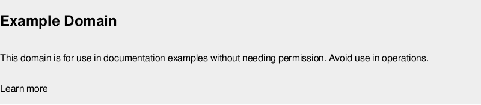
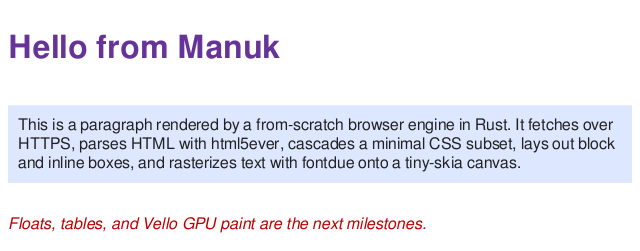

# Manuk

A browser engine, built from first principles in Rust, per the directive in
[`CLAUDE.md`](./CLAUDE.md). It has two front-ends over one shared engine core:

- a **headful, human-operator GUI browser** (`shell`), and
- a **headless agentic browser** (`agent`) an LLM can drive.

The engine core (net · html · dom · css · layout · text · js) is shared; the two
front-ends diverge only at how they *consume* a rendered page — the shell presents
it to a `winit`/`wgpu` window, the agent screenshots and reads it.

This repository is a **working foundation**, not a finished browser — a
standards-complete engine is the scope of Servo/Chromium. What exists today is the
full crate architecture the directive mandates, the real dependencies wired in, and
**two working vertical slices** on top of the same core:

```
                         ┌── shell   → winit/wgpu window        (headful)
net → html → dom → css → layout → text → paint ──┤
                         └── agent   → screenshot + LLM loop    (headless)
```

Rendering `https://example.com/` and a local test page (CPU raster tier, produced
headlessly by `manuk render` — the same rasterizer the agent screenshots):





## Try it

```bash
# --- Headful engine ---
# Headless render to PNG (no GPU/display needed — the CPU raster tier):
cargo run -p manuk-shell --no-default-features -- render https://example.com/ -o out.png --width 800
# Interactive GPU window (winit + wgpu); needs a display:
cargo run -p manuk-shell -- browse https://example.com/

# --- Agentic browser (needs a Groq API key) ---
# Put GROQ_API_KEY=... in a .env file (or export it), then:
cargo run -p manuk-agent --bin agent-run -- "What is this page's main heading?" https://example.com/

# --- Conformance + tests ---
cargo run -p manuk-wpt          # built-in layout reftests (WPT-backed later)
cargo test --workspace          # 40 tests
```

## Architecture

The workspace maps onto the CLAUDE.md stack table. **Reuse** = mature crate wired
in; **Build** = from-scratch, to be WPT-verified.

| Crate | Role | Approach | Status |
|---|---|---|---|
| `engine/net` | HTTP(S): `hyper` + `rustls` + `tokio`; `fetch` (GET+redirects) and general `request` (POST) | Reuse | HTTP/1.1 + TLS working; the Groq client reuses it |
| `engine/html` | HTML parse via `html5ever` → DOM | Reuse | Working |
| `engine/dom` | Arena DOM tree (shared core) | Build | Working |
| `engine/css` | `StyleEngine` trait + minimal cascade; **Stylo** behind `--features stylo` | Reuse target | Minimal cascade working; Stylo links, adapter delegates |
| `engine/layout` | From-scratch **block + inline** layout; `taffy` for flex | Reuse + build | Block/inline/wrap/center working; flex via taffy; tables/floats next |
| `engine/text` | `fontdb` discovery + `fontdue` metrics/raster (swash/Parley family) | Reuse | Latin shaping + rasterization working |
| `engine/js` | `JsRuntime` trait + no-op default; **SpiderMonkey** behind `--features spidermonkey` | Reuse | No-op default; SpiderMonkey **evaluates real JS** under the feature |
| `engine/paint` | Display list + **CPU raster tier** (`tiny-skia` + glyph blit); Vello GPU tier is the focused-tab target | Reuse target | CPU tier renders to PNG; Vello slots behind `Painter` |
| `engine/compositor` | Tab tiers (focused-GPU / background-CPU / hibernated), damage, scroll | Build | Policy/state working |
| `engine/page` | **Shared pipeline**: bytes→DOM→style→layout→paint; link/text extraction | Build | Working; used by shell **and** agent |
| `shell` | `winit`/`wgpu` window, tabs, navigation; `render`/`browse` CLI | Build | Headless `render` + interactive `browse` |
| `agent` | **Headless agentic browser**: driver + backend-agnostic loop + Groq backend | Build | Navigate/click/scroll/screenshot; live-tested on Groq |
| `tests/wpt` | WPT harness + results tracking | — | Built-in layout reftests run; upstream WPT runner is the growth path |

### Deliberate deviations from the CLAUDE.md suggested layout

- **`engine/dom` is its own crate.** The suggested layout groups "DOM + Web API
  surface" under `/engine/js`. The DOM *tree* is consumed by html/css/layout, none
  of which should depend on the JS engine, so the tree lives in `engine/dom` and
  `engine/js` holds the *bindings* that project it into the runtime.
- **`engine/page` is the shared front-end-agnostic pipeline.** It is the concrete
  realization of "headful and headless share the core, diverge at paint."

## The agentic browser

The agent side is layered so each piece is independently testable and swappable —
and, per the brief, **the agent logic is decoupled from both the harness driving it
and the inference backend**:

- **`AgentBrowser`** — a headless page driver over `engine/page`. Knows nothing
  about LLMs: `navigate`, `scroll`, `screenshot_png`, `observe` (URL, title, links
  by index, visible text). Renders via the CPU tier, so it is display-free.
- **`InferenceBackend`** — the provider-agnostic model trait
  (`async fn complete(&[Message]) -> String`), object-safe and multimodal
  (text + PNG image content). `GroqBackend` is one implementation; it posts to
  Groq's OpenAI-compatible endpoint **through `engine/net`** (hyper + rustls — no
  separate HTTP client, no OpenSSL) and strips `<think>…</think>` reasoning blocks.
- **`run_task`** — the observe→decide→act loop. It takes `&dyn InferenceBackend` and
  `&mut AgentBrowser`; it never names a provider or a harness. Actions are a small
  JSON protocol: `navigate` / `click` / `scroll` / `finish`.

Default model: `qwen/qwen3.6-27b` (multimodal, Groq), overridable via `GROQ_MODEL`.

### Runners

- **`agent-run`** (committed) drives the agent with a **single** `GROQ_API_KEY`
  (falls back to `GROQ_API_KEY` from `.env`).
- **`agent-run`** is a **local-only** capability harness that cycles through
  `GROQ_API_KEY..N` (one key per test, to spread rate limits) and exercises text
  extraction, link comprehension, link navigation, and multimodal screenshot
  reading. It is **gitignored** — only the single-key runner is committed. It reuses
  the exact same `run_task`; it is just a driver.

Live capability run (qwen/qwen3.6-27b, screenshots rendered by our own engine):

```
[1/4] text-extraction        PASS  answer: Example Domain
[2/4] link-comprehension     PASS  answer: Example Domain site
[3/4] link-navigation        PASS  answer: Example Domain
[4/4] multimodal-screenshot  PASS  answer: light
4/4 capabilities passed
```

`.env` (holding the keys) is gitignored and never committed.

## The JS-engine modification boundary

Per CLAUDE.md's most important section: `engine/js` **configures and binds to**
SpiderMonkey (`mozjs`, the Servo path — not V8). It never patches JIT/GC internals
or the sandbox — a "come back to the human" boundary. The engine is a
process-global singleton (init once, share across isolates). The `spidermonkey`
feature is proven to build and evaluate JS here; the default build ships the no-op
runtime.

## Performance-target hooks in place

- Release profile: `opt-level="s"`, `lto=true`, `codegen-units=1`, `panic="abort"`,
  `strip=true` (binary size).
- `.cargo/config.toml`: static-CRT / musl target flags for fully-static binaries
  (opt-in per target).
- Compositor models the isolate-per-tab memory tiers (focused GPU + active JS;
  background CPU + frozen JS; hibernated/evicted).
- `Bytes`-based response bodies and html5ever's streaming sink are positioned for
  the incremental parse/layout path.

## Next frontiers

Layout tables/floats/positioning · external stylesheet + image fetching · gzip/br
decoding · HTTP/2+3 activation · encoding sniffing · the real Stylo and Vello
integrations · viewport-clipped text observation for the agent · richer agent
actions (type/forms) · the upstream WPT runner. Each sits behind an existing seam.
